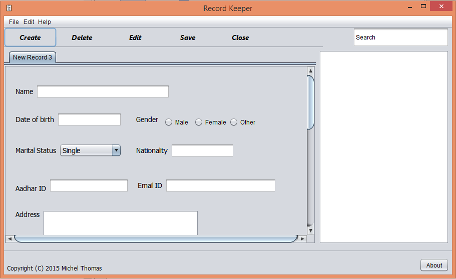

# record-keeper
A database that keeps track of clients for a counsellor.

# Overview

One of my very first projects(2015). The client insisted on a 'minimalistic' design, ergo, the bland appearance.
The design of the program is fairly simple; The UI is written using java that is linked to a JavaDB database.

The requirements to build this project are:

      jdk 1.7 or higher
   
      Netbeans IDE
   
      javaDB server
   

# Author

 Michel Thomas.
 
# License
 
 GNU General Public License, version 2.
